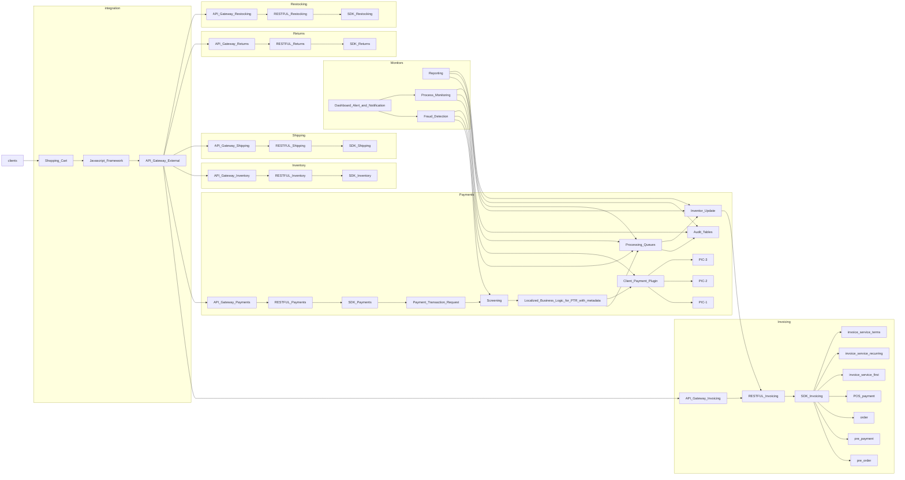

# prototype-payment-system
Prototype a payment system

# Summary

# Design Goals
- multi-tenant
- scalable
- event driven
- container-ized
- auditable
- plugable payment 
- locality-sensitive business rules
- distributed transaction event logging and tracing
- dashboards: status, alerts, notiications
- 

# Diagram
## Placeholder

# Components
- APIG: API Gateway
- PTR: Payment Transaction Request
- LBL: Localized Business Logic for PTR with metadata
- CPP: Client Payment Plugin
- PIC: Payment Integration Client
- PQ: Processing Queues
- AT: Audit Tables
- IU: Inventor Update
- FD: Fraud Detection
- DA: Dashboard Alert and Notification
